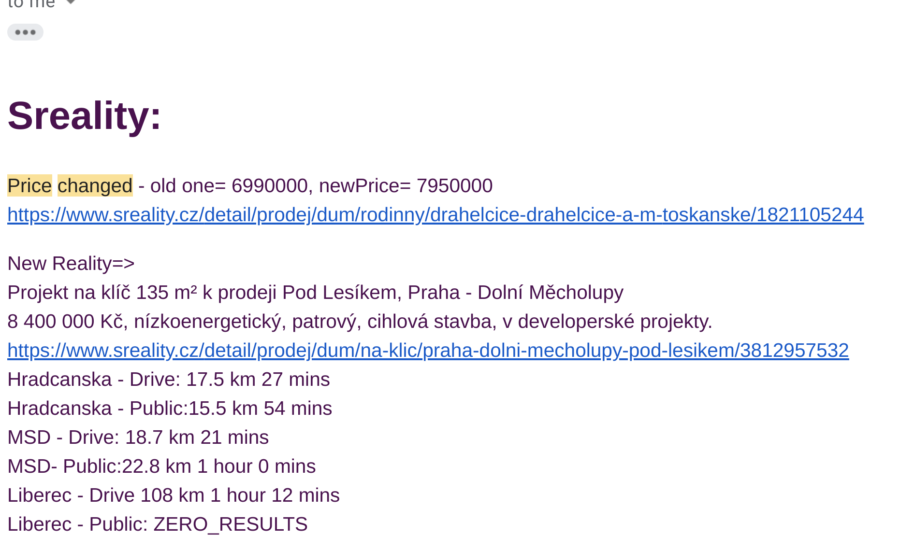
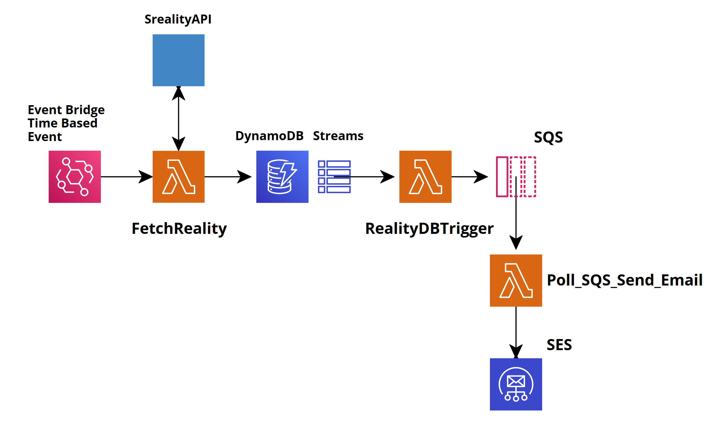

# SReality.cz Price tracking and notification
Requests, store and send daily e-mail updates from properties at sreality.cz. Tracking price change. Also using google API for commute calculation.

This is not an official API. I am not affiliated with Sreality.cz in any way, and am not responsible for any damage that could be done with it.


Scheduled email result: 



Arhitecture :


How to deploy->
Add and uncomment GoogleAPI key into LAMBDA,use your DBnames and ad your own email
then install cdk 
CDK project:
```
$ cdk init MyReality --language python
$ sudo python3 -m venv .venv
$ source .venv/bin/activate
pip install -r requirements.txt
```
documentation
https://docs.aws.amazon.com/cdk/api/latest/docs/aws-construct-library.html


adding modules into venv 
```
python -m pip install aws-cdk.aws-dynamodb 
```

```
$ cdk diff 
$ cdk deploy
```

#Known issues(aka lazy to implement):

1. Permissions for queue are not in CDK, needs to be set up manually after deployment
2. Sreality has its own commute callcualtion -> problem with oauth
```
$ https://www.sreality.cz/api/cs/v2/rus/locality/2734632540?transport=by_bike&lat=50.7924469338626&lon=15.0706687243478
```
3. google API results are given in real time, they will vary according to the time of the day you’re retrieving it


ENJOY!


